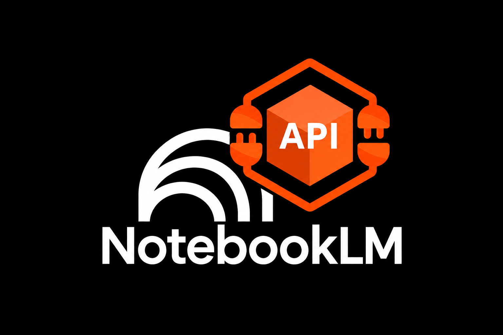

# NotebookLM APIs, REST, RESTful

## Contexto e objetivos
Este NotebookLM é sobre APIs, abordando a importância do RESTful e todos os outros assuntos inerentes com o intuito de inicializar/complementar a formação de um desenvolvedor Nível Júnior para dominar APIs RESTful em Node.js. Com este Notebook é possível auxiliar qualquer pessoa de forma autodidática em um ambiente guiado para que aprenda e aplique o conhecimento de forma prática com o apoio dessa mentoria digital proporcionada pelo NotebookLM, e garantir que esta pessoa se torne um(a) profissional seguro(a) e confiante.

## Curadoria de Fontes
Dentre as 37 fontes presentes nesse NotebookLM, diversificadas entre textos organizados em módulos, vídeos e 5 PDFS em português, listo abaixo 3 dessas fontes em PDF que foram utilizadas:

> Construindo APIs REST com Node.js (Caio Ribeiro Pereira — Editora Casa do Código)

🔗 Link: [Acessar PDF](https://www.kufunda.net/publicdocs/Node.js%20-%20Aplica%C3%A7%C3%B5es%20web%20real-time%20com%20Node.js%20%28Caio%20Ribeiro%20Pereira%29.pdf)

📝 O que cobre: Guia prático completo sobre construção de APIs RESTful com Node.js, Express, autenticação JWT, Sequelize/banco de dados, rotas e documentação.

>Plano de Ensino e Guia Prático de APIs REST + Node.js (Universidade Federal do Paraná — UFPR)

🔗 Link: [Acessar PDF](https://books-sol.sbc.org.br/index.php/sbc/catalog/download/142/627/1070?inline=1)

📝 O que cobre: Documento acadêmico da UFPR detalhando rotas e endpoints com Express, middlewares, autenticação JWT, integração com MongoDB, padrão MVC e deploy (CORS e ambiente de produção).

>Node.js — Aplicações Web e Persistência NoSQL (Caio Ribeiro Pereira — Editora Casa do Código)

🔗 Link: [Acessar PDF](https://t2ti.com/erp3-pdf/TCC%5FTHIAGO%5FOLIVEIRA%5FDE%5FSOUZA.pdf)

📝 O que cobre: Foco em arquitetura Node.js, Mongoose, modelagem de dados NoSQL no MongoDB, implementação de CRUD e tratamento de conexões.
  

## Engenharia de Prompts e "Cicatrizes"
[Como estruturei este NotebookLM em 8 módulos e imagino ter coberto boa parte dos estudos sobre REST, RESTful (mais...)](./engenharia-prompts.md)

## Variações de prompts que testei:
[Respostas obtidas e dificuldades encontradas para extrair a melhor resposta da IA (troubleshooting) (mais...)](./variacoes-prompt-testadas.md)

 
 

# Entrega Final - Miniguia de Estudo

## [- Resumos Estruturados](./resumos-estruturados.md)
## [- Estudo Guiado>](estudo-guiado.md)
## [- Glossário com os principais conceitos aprendidos](/glossario.md)
## [- Conjunto de prompts reutilizáveis para futuras revisões sobre o tema](./prompts-reutilizaveis.md)

 

## 👨‍💻 Autor

    
    
&nbsp&nbsp&nbspEdmundo Batista 
    &nbsp&nbsp&nbsp
    <a 
        href="https://github.com/eddgh">
        GitHub
    </a>
    &nbsp;|&nbsp;
    <a 
        href="https://linkedin.com/in/edmundo-jos%C3%A9-3660b76a">
        LinkedIn
    </a>

  

[&#x1F51D;](#)
---